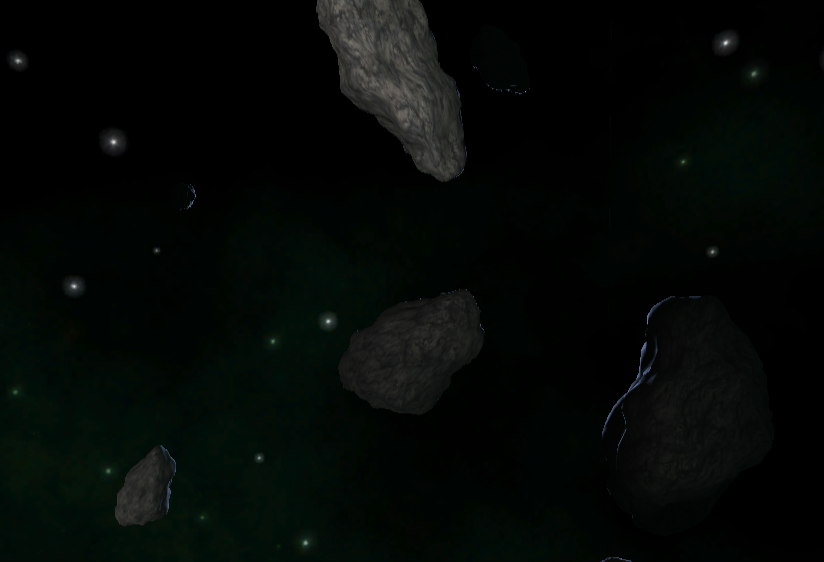
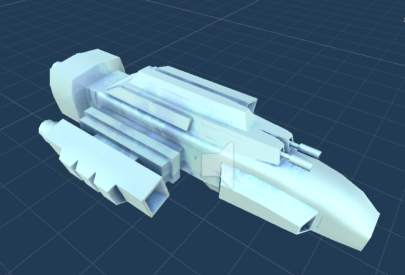

# StarRUNNER

This is a casual game where you wander through lustrous and beautiful space to find other spaceships, the game is from the perspective of the First Person Camera. So, you should see what the camera sees without any obstruction and control you ship likewise. 

You can play the game here https://amitansu1024.itch.io/starrunner
## Environment

### SkyBox / Distant Space Screen

The far space is filled with green nebula clouds and distant small starts which sets the vibe of the deep space, this pattern is non-repeating so, everywhere you see you will have some different views.

### Asteroids

The asteroids are procedurally generated for every playthrough meaning their position, shape and size would be different each time you play the game. The player has to navigate through this cluster of asteroids while looking for other spaceships.

The asteroids are constantly rotating and also have collision to them, this means when the player will collide with them they will lose health. 

### Lighting
There are two types of lighting present in the scene:- 
1. Omniscient Blue light - This gives the dark blue light to everything in the scene, enhances the darker look of the space and grounds the objects in the space settings. 
2. Dim White light - With the blue light on one side, the other side of objects become completely black, to avoid invisibility in space, there is a dim white light to help the players see the asteroids from all angles.  

## Player Spaceship 
### Controls
You will play through the First Person Camera, you can control the Ship through WSAD Keys on your keyboard, for forward, down, left and right respectively.

You can also control where you are looking at i.e rotation of your spaceship by your mouse. Simply move your mouse to where you want to see. 

### Lives
The player has 5 lives which decrease by the collision with asteroids.

## Other Spaceship
### 3D Model 
The other spaceship which the player has to collect in order to score is a blue spaceship.

### AI behaviour
The ship is idle at start, but will become aware of the player ship if it comes too close. Then it will start to avoid it. 

The AI will avoid any obstacles such as the asteroids on its own, in addition to that the ship will always try to be at a safe space i.e not too far and not too close so, the player doesn't go too far from the centre. 

## Dialogues 
### Initial Dialogue 
There is a intial dialogue which will appear in player's screen at the start of the game. 
### Aware Dialogue 
A dialogue appears when the other ship gets alerted about player's presence. 
### Collected Dialogue 
When the other ship is collected a dialogue will appear notifying it to the player.

## UI
There are UI elements all over game, from Lives and score UI to Main Menu, Tutorial, Pause and etc. 

Everything necessary for the game has been implemented with the UI.